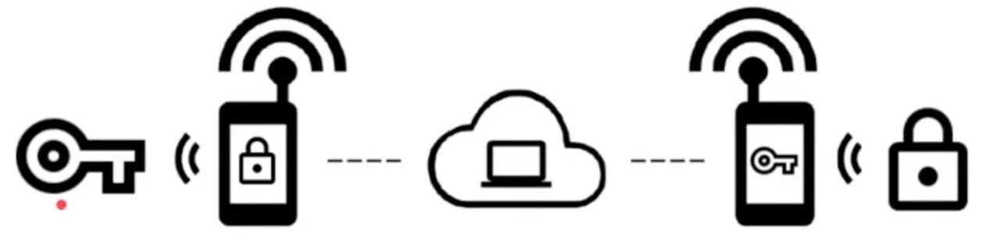

## Meta steps:

```sh
# Check this out
mv .env.example .env

# generate project venv workspace
python3 -m venv .venv

# activate project venv workspace
source .venv/bin/activate && which python

# deactivate project venv workspace
deactivate && which python

# dependencies
python -m pip install protobuf python_dotenv

# generate proto files
make protogen

# NOTE! make shure NFCGATESERVER_SERVICE_HOST (.env) is correct

# start server locally
make run

# start network cluster
make run-cluster
```
### Server mode:
- --tls - should be --tls_key --tls_cert
- --verify - should be over tls with --ca_cert (for check child/client cert on sefety)
